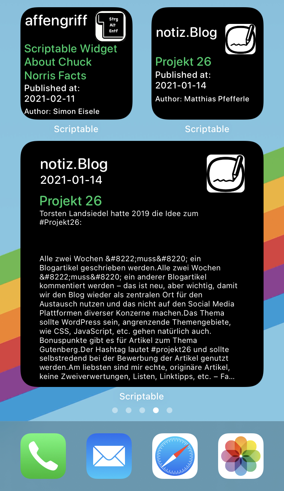

# Wordpress Blog IOS Widget
Loading JSON content from website to display it in the IOS widget by Scriptable

This is a collection of iOS-Widget scrips, which can be used with the Scritable App. You have do download App "Scriptable" from the App Store: https://apps.apple.com/de/app/scriptable/id1405459188

# How to add scriptable widget to the home screen

Regardless of which widget you have chosen, the setting procedure in iOS is always the same:

- First, add the copied code to a new script.
- With a tip on the controller icon at the very bottom in the left corner of the screen, you can give the script a meaningful name and select a suitable icon (glyph) for it.
- After that, switch to the widget screen by scrolling left on your home screens as long as possible.
- Tap and hold on this screen until the preset widgets start to wobble. You are now in edit mode. In this mode, tap on the plus sign in the upper left corner and scroll down to „Scriptable“ in the list that appears.
- Here you can still select the appearance and add the widget.
- Tap the Scriptable widget again while the icons are wobbling. Here you have the opportunity to select the appropriate script.
- To do this, tap on „Select“ in the „Script“ line, the app will show you all the scripts that have been created so far, which can now be selected. Then drag the widget to a location on the screen of your choice and exit edit mode.

https://www.macwelt.de/tipps/So-erstellen-Sie-eigene-iOS-Widgets-Klopapier-bei-DM-Corona-Zahlen-Datenvolumen-bei-Telekom-10910000.html
