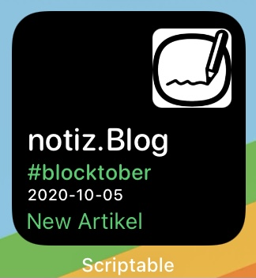

# Wordpress Blog IOS Widget
Loading JSON content from website to display it in the IOS widget by Scriptable

This is a collection of iOS-Widget scrips, which can be used with the Scritable App. You have do download App "Scriptable" from the App Store: https://apps.apple.com/de/app/scriptable/id1405459188

# Wie man Scriptable-Widget dem Home-Screen hinzufügt

Egal, für welches Widget Sie sich entschieden haben, das Einstellungsprozedere in iOS ist immer das gleiche:

Fügen Sie zunächst den kopierten Code einem neuen Script hinzu.

Mit einem Tipp auf das Regler-Icon ganz unten in der linken Ecke des Bildschirmes können Sie das Script aussagekräftig benennen und ein passendes Icon (Glyph) dafür auswählen.

Danach wechseln Sie in den Widget-Bildschirm, indem Sie in Ihren Home-Bildschirmen so lang wie möglich nach links scrollen.

Tippen und halten Sie in diesem Bildschirm so lang, bis die voreingestellten Widgets beginnen zu wackeln. Sie sind nun im Bearbeitungs-Modus. Tippen Sie in diesem Modus auf das Plus-Zeichen in der oberen linken Ecke und scrollen Sie in der erscheinenden Liste bis zu "Scriptable".

Hier können Sie noch das Aussehen auswählen und das Widget hinzufügen.

Tippen Sie nochmals auf das Scriptable-Widget, solange die Icons wackeln. Hier bekommen Sie die Möglichkeit, das passende Script auszuwählen.

Tippen Sie hierzu auf "Auswählen" in der Zeile "Script", die App wird Ihnen alle bisher erstellten Scripts einblenden, die sich nun auswählen lassen. Ziehen Sie das Widget anschließend auf eine Stelle im Bildschirm Ihrer Wahl und beenden Sie den Bearbeitungsmodus.

https://www.macwelt.de/tipps/So-erstellen-Sie-eigene-iOS-Widgets-Klopapier-bei-DM-Corona-Zahlen-Datenvolumen-bei-Telekom-10910000.html
